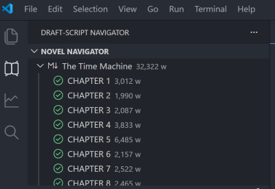
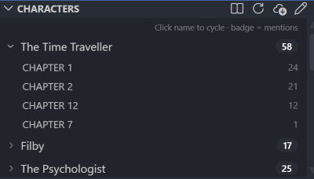
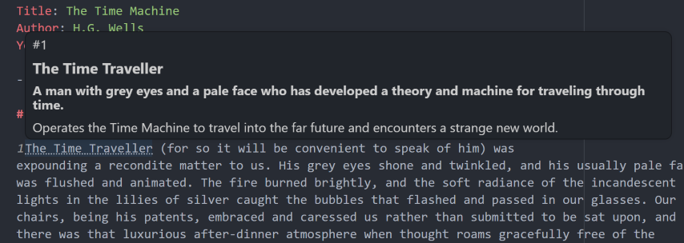
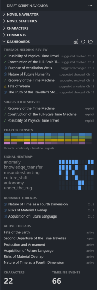
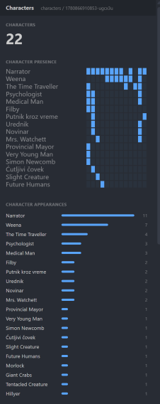
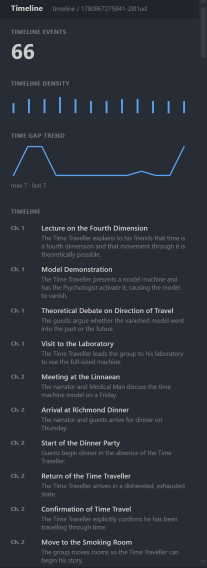
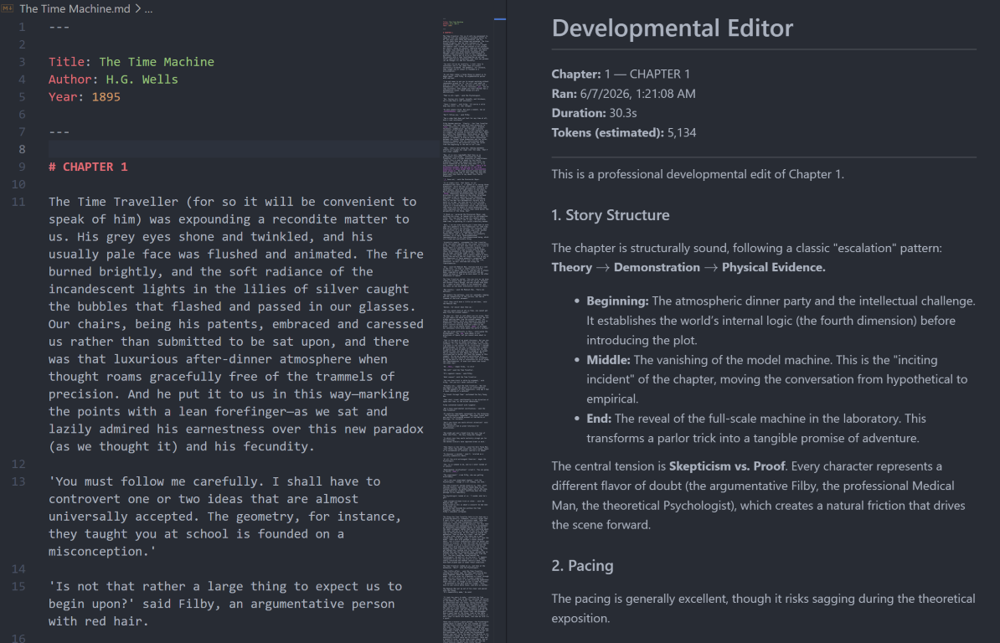

# Draft-Script
[](https://marketplace.visualstudio.com/items?itemName=MGAlter.draft-script)
[](./LICENSE)

A VS Code extension for long-form fiction writing.

Draft-Script combines a lightweight Markdown workflow with novel-focused tools: manuscript navigation, writing notes, story tracking, custom AI workflows, and project dashboards.

The manuscript remains the source of truth. Everything else can be rebuilt from the text.

No locked project format.
No database-first writing system.
No all-in-one platform trying to take over your workflow.

Just Markdown, generated indexes, and tools that stay out of the way.

---

## Why Draft-Script Exists

Draft-Script was built to support active long-form writing projects after years of trying different tools and workflows.

The goal was a lightweight, text-first environment where writers keep full control over their manuscripts and data. Most features were added to solve real problems during the writing process:

- Where did this character last appear?
- Did I forget an open thread?
- Which chapter mentioned this location?
- How much time passed between these scenes?
- Did I repeat the same phrase too often?
- What continuity facts must future chapters respect?

Draft-Script continues to evolve through daily use on active manuscripts.

---

## Core Idea

Draft-Script treats your Markdown files as the source of truth and builds generated indexes around them.

Indexes cover:

- characters, locations, objects, groups
- story threads and their lifecycle
- continuity notes
- timeline events
- time data (season, duration, gaps between chapters)
- signals -- recurring narrative patterns
- reference passages -- links from index entries back to the exact manuscript text

Generated data can be deleted and rebuilt at any time. Author decisions and overrides are stored separately.

---

## Features

Features are split into two groups: those that work without any AI, and **DSM** -- the AI-powered story monitoring system.

---

### Without AI

#### Novel Navigator

Browse chapters, jump between scenes, and keep large manuscripts organized.

The navigator lists all Markdown files and their headings in a tree. Each item shows a live word count badge. Chapter headings display a scan status icon when DSM is active:

| Icon | Meaning |
|---|---|
| grey outline | Not yet analyzed |
| green checkmark | Analyzed, up to date |
| orange sync | Analyzed, but chapter has changed since the last scan |



---

#### Chapter Management

Commands for inserting, moving, and renumbering chapters in multi-file manuscripts.

- **Insert Chapter Before / After** -- shifts existing files up by one and creates the new chapter.
- **Move Chapter** -- reorders a chapter to any target position and renumbers all affected files.
- **Renumber Chapters** -- sorts and renumbers all chapter files sequentially from scratch.

All commands update chapter numbers in YAML front matter automatically. Available from the right-click menu on Navigator file items.

---

#### Chapter Focus Mode & Typewriter Mode

**Chapter Focus Mode** controls how the Navigator opens chapters:

- **Continuous** -- clicking a heading scrolls the full source file to that heading.
- **Focus** -- clicking a heading opens only that chapter's text in a dedicated tab. Edits sync back to the source file automatically. (Single-file novels only.)

Toggle with the target icon in the Navigator toolbar, or via the Command Palette.

**Typewriter Mode** keeps the cursor vertically centered as you type, scrolling the text upward like paper through a typewriter. Disabled by default -- toggle via `draftScript.typewriterMode`.

---

#### Novel Statistics

A sidebar panel showing word count, unique words, character count, estimated pages, estimated lines, and reading time.

The panel is cursor-aware: it automatically switches between novel-wide and chapter-level stats based on where the cursor is. Lock it to a specific scope using the toolbar lock icon.

---

#### Characters Panel & Character Hover

Lists all characters from the Canon Editor with mention counts across the novel. Add characters manually via Canon Editor → New, or they are populated automatically after DSM analysis. Expand any character to see a per-chapter breakdown.

Hover over any character name in the editor to see that character's description and aliases as a tooltip -- without switching panels.



---

#### Writing Notes

Attach private notes to any selected passage in the manuscript.

- Right-click selected text -- *Add Comment to Selection*
- The passage is marked with an invisible HTML annotation tag; the note is appended to `notes.md`.
- Annotated passages are highlighted in the editor with hover tooltips showing the note text.



---

#### Repetition

A sidebar panel that analyzes word and phrase frequency across the novel or current chapter. Helps identify overused words and repeated phrasing. Click any phrase to jump to its next occurrence in the text. The panel can be locked to novel-wide analysis, and repeated phrases can be sent through a review-first line-edit workflow with optional diffs before applying changes.

---

#### Quality of Life

- **Smart Dashes** -- typing `--` automatically converts to an em-dash. Can be disabled via `draftScript.enableSmartDashes`.
- **Auto-Refresh** -- the Navigator, Statistics, Characters, Repetition, and Dashboard panels refresh automatically when any Markdown file changes.
- **Export Build** -- build the current manuscript into `exports/manuscript.md` without any external tools. Optional DOCX, EPUB, HTML, and PDF export uses an external Pandoc installation; PDF may also require a TeX/PDF engine such as `xelatex`.

---

### DSM -- Draft Script Monitor

DSM is the AI-powered part of Draft-Script. It analyzes chapter text using an LLM and extracts structured indexes -- characters, locations, threads, continuity, timeline, and more. Everything passes through a review step before anything is written to disk.

All DSM features require an LLM provider (GitHub Copilot, OpenAI, Ollama, or Mock for offline testing). DSM can be disabled entirely with one setting -- all non-AI features remain unaffected.

 

More Screenshot in [User Guide](./USER_GUIDE.md)

---

#### Story Tracking

Extract and maintain searchable indexes from the manuscript text using an LLM.

Tracks per chapter, then aggregates across the novel:

- Characters -- appearances, roles, descriptions, aliases
- Locations -- appearances and references
- Objects -- introductions and usage
- Groups and factions -- membership and activity
- Timeline events -- extracted and ordered
- Continuity notes -- facts future chapters must respect
- Reference passages -- quoted or paraphrased text linked back to the exact manuscript location

Each indexed item includes appearance counts, chapter history, and one-click navigation back to the manuscript.

---

#### Thread Tracking

Track story threads as lifecycle records across the novel.

Thread statuses: open, active, changed, resolved, uncertain.
Thread types: mystery, promise, risk, task, question, conflict, system.

DSM records how each thread progresses, stalls, or resolves across chapters. Suggested resolutions, review flags, and parent/sub-thread relationships are supported.

---

#### Continuity Tracking

Maintain generated continuity notes for facts future chapters must respect.

Types: state, resource, construction, technology, relationship, promise, risk, population, logistics.

Notes are generated from the manuscript and linked back to the original passage as evidence.

---

#### Timeline & Time Index

Track the story's temporal structure across chapters.

DSM extracts:

- Timeline events -- what happened and when
- Chapter season and seasonal span (start/end)
- Scene duration vs. covered story time (a one-day scene in a chapter that spans months of story time)
- Chapter temporal anchor -- the dominant present-time season after each chapter concludes
- Time references tagged by role: current, flashback, dream, history, projection

Use the time index in dashboards to inspect seasonal movement, duration estimates, and gaps between chapters.

---

#### Signals

Track recurring narrative patterns across the novel with configurable semantic labels.

Define signals in the Canon Editor (e.g. `knowledge_transfer`, `autonomy`, `institution_seed`). The LLM tags matching timeline events, threads, and continuity notes with your signal IDs during analysis. Only IDs from your defined list are accepted -- hallucinated IDs are filtered out.

Signals feed into the Story Navigator and custom dashboards for pattern-level views of the manuscript.

---

#### Canon Editor

A full editor for all canon data.

- Edit names, aliases, and descriptions for characters, locations, objects, and groups.
- Merge duplicate entries -- all analysis references are rewritten automatically.
- Delete entries.
- Create, reorder, and manage signal definitions.
- Read-only views for threads, timeline, and continuity with chapter navigation.

Each entity card lists every chapter where that entity was detected. Click any chapter number to jump to the exact reference passage.

---

#### Story Navigator

A popup panel for searching and browsing all DSM indexes.

**Search mode** -- type any term to search across all indexes at once: threads, continuity, characters, locations, objects, groups, and timeline. Results show type and status badges and chapter appearance chips. Click any chip to jump directly to the reference passage in the manuscript.

**Browse mode** -- explore a single index type using the tab bar (Threads, Continuity, Characters, Locations, Objects, Groups, Timeline, Signals). A text filter input narrows results as you type. Threads and Continuity also support type and status pill filters. The Signals tab lists signals sorted by frequency and expands to show linked entities and chapters.

---

#### Custom Prompt Runner

Define reusable prompts as plain Markdown files with a YAML header. Run them on any chapter from the Navigator right-click menu or the Command Palette.

Prompts can receive context from DSM indexes -- active threads, continuity notes, timeline, characters, and more -- letting custom workflows work with the manuscript structure instead of isolated text.

Prompt types: developmental editing, beta reading, continuity checking, pacing analysis, translation, character sheets, encyclopedia generation, publishing exports, or any project-specific workflow.

**Writer prompts** -- mark a prompt with `writer: true` to add an optional chapter-brief step before the LLM call. Use `{{userBrief}}` and `{{nextChapterNumber}}` as placeholders in the prompt or output path.

Four commands share the same prompt picker:

- **Preview Prompt** -- inspect assembled context blocks and token counts before any LLM call.
- **Copy to Clipboard** -- copy the rendered prompt for use with external tools (ChatGPT, Claude, Gemini).
- **Run Prompt** -- send to the LLM; result opens in a tab beside the chapter.
- **Run And Save Output** -- send to the LLM; result is written directly to a file as defined in the prompt's `output:` config.



---

#### Custom Dashboards

Build dashboard views from DSM indexes using JSON profile files.

Widgets available: stat cards, status lists, bar lists, warning lists, thread lifecycle views, continuity tables, and timeline summaries. Multiple dashboard panels can be open simultaneously. Profiles are stored as JSON in `.draft-script/dashboards/` and can be customized per project.

Built-in profiles: threads, timeline, characters, continuity.
Preset examples in `examples/dashboards/`: mystery, fantasy-worldbuilding, character-drama, chronicle, sci-fi.

---

#### Mark as Scanned

Right-click a chapter heading in the Navigator -- *DSM: Mark as Scanned* -- to reset the orange sync indicator without re-running analysis.

Use this when a chapter changes in a way that does not affect the indexes: a corrected typo, a reformatted paragraph, an added blank line.

---

## AI Is Optional

DSM requires an LLM provider:

- **GitHub Copilot** via VS Code Language Models (default -- requires Copilot)
- **OpenAI** (requires API key)
- **Ollama** (local models, no API key or internet required)
- **Mock** (offline testing, returns sample data without any LLM call)

All DSM features can be disabled with a single setting:

```json
"draftScript.enableLLM": false
```

The manuscript, notes, navigation, statistics, characters, and repetition panels remain fully usable without AI.

---

## Philosophy

- Manuscript text is the source of truth
- Generated indexes are disposable and can be rebuilt at any time
- Author decisions are stored separately from generated data
- Prefer rebuild over migration
- Keep configuration simple
- Avoid vendor lock-in
- Store everything in human-readable files
- Tools should support writing, not interrupt it

---

## Documentation

- [User Guide](./USER_GUIDE.md) -- full feature reference and settings
- [Prompt Runner](./PROMPTS.md) -- custom prompt system reference
- [Dashboard Configuration](./DASHBOARD.md) -- dashboard widget and profile reference

---

## Support

Draft-Script is developed in spare time and released as open source.

If Draft-Script helps you finish a story, catch continuity issues, or save time while writing, your support helps keep the project moving.

[Support Draft-Script on Patreon](https://patreon.com/MGAlter)

---

## Disclaimer

Draft-Script is provided as-is, without warranty of any kind.

Always keep backups of your manuscripts and project files. Draft-Script is designed to work with plain text files and rebuildable indexes, but you are responsible for your own data, backups, publishing decisions, and use of AI-generated outputs.

See the MPL-2.0 license for the full warranty and liability terms.

---

## License

Draft-Script is licensed under the Mozilla Public License 2.0 (MPL-2.0).
