# Draft-Script

A focused writing environment for authors working on long-form books and novels in Markdown — inside VS Code.

---
## Important
Before using Draft-Script on important manuscripts, keep your project under version control or maintain regular backups.

---

## Features

### Novel Navigator

A sidebar panel that lists all your Markdown files and their headings in a tree. Each item shows a live word count badge. Click any heading to navigate directly to it — or open it in isolation with Chapter Focus mode.

Top-level chapter headings (h1) display a scan status icon:

| Icon | Meaning |
|---|---|
| ○ grey outline | Not yet analyzed by DSM |
| ✓ green | Analyzed — content matches the last scan |
| ↻ orange | Analyzed — but chapter text has changed since the last scan |

Sub-headings (h2 and deeper) display without icons and with a small indent.

The orange sync icon means DSM's index for that chapter may be outdated. Re-analyze the chapter to bring it back in sync.

If a chapter changed in a way that does not affect the indexes — a corrected typo, a reformatted paragraph, a blank line added — right-click the heading → *DSM: Mark as Scanned*. This updates the stored content hash to the current text and clears the orange indicator without touching any index or canon entry.

**How change detection works:** When a chapter is analyzed, DSM stores a SHA-256 hash of that section's exact text. On every tree refresh, the Navigator re-hashes each section and compares it against the stored value. Because the hash covers only the specific section, changing one chapter in a single-file novel flags only that chapter — not all of them.

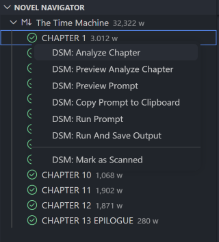

### Chapter Focus Mode

Toggle between two navigation modes using the target icon in the Navigator toolbar (or `Ctrl+Shift+P` → *Toggle Chapter Focus*):

- **Continuous** — clicking a heading scrolls the full source file to that position.
- **Focus** — clicking a heading opens only that chapter's text in a dedicated tab, so distractions from other chapters disappear. Edits sync back to the source file automatically.

### Add Chapter

Create a new chapter file with a single action. The chapter number is auto-detected from existing files so numbering stays consistent.

- **Toolbar button** — click the `+` icon in the Navigator panel.
- **Keyboard shortcut** — `Ctrl+Enter` from anywhere.

A prompt pre-fills the title with the next chapter number using your configured format (e.g. `Chapter 4: `). Confirm, and the file is created and opened immediately.

### Chapter Management

Commands for inserting and renumbering chapters in multi-file manuscripts where each chapter is a separate numbered file (e.g. `23 - Arrival.md`).

**Insert Chapter Before / After**

Available from the Command Palette and from the right-click context menu on any file item in the Navigator.

- Prompts for the new chapter title.
- Shifts all affected chapter files up by one (renaming them in reverse order to avoid collisions).
- Updates any `chapter:` or `number:` field in YAML front matter automatically.
- Creates the new file and opens it in the editor.

**Move Chapter...**

Available from the Command Palette and from the right-click context menu on any file item in the Navigator.

- Prompts for the target chapter number (the number the moved chapter should have after the operation).
- Reorders the chapter list in memory, then renumbers all affected files sequentially to keep numbering consistent.
- Uses a two-phase rename (via temporary names) to avoid collisions.
- Updates any `chapterNumber:`, `chapter:`, or `number:` field in YAML front matter automatically.
- Opens the moved chapter in the editor when complete.
- Shows a confirmation prompt when two or more files will be renamed.

**Renumber Chapters**

Available from the Command Palette and from the right-click context menu on any file item in the Navigator.

- Scans all numbered chapter files across the novel folder.
- Sorts them by their current numbers and renumbers sequentially starting from 1.
- Uses a two-phase rename (via temporary names) so no files are accidentally overwritten.
- Updates front matter fields where present.
- Asks for confirmation before making any changes.

Supported file naming formats: `23 - Title.md`, `023-title.md`, `7 Title.md`, and similar `{number}{separator}{title}` patterns. Files that do not match a numbered pattern are left untouched.

### Novel Statistics

Shown in the Navigator sidebar below the tree. Displays word count, unique word count, character count, estimated pages, estimated lines, reading time, chapter count, and file count.

The panel is **cursor-aware**: as you write, it automatically shows stats for the chapter your cursor is in — no clicks required. Move the cursor before the first heading and it switches back to the full novel view. Works in both Continuous and Focus modes.

The current scope is shown at the top of the panel:

- **Scope: Novel** — stats cover the entire manuscript.
- **Scope: Chapter** — stats cover only the chapter the cursor is currently in, with the chapter title shown below.

Use the **lock icon** in the panel toolbar to pin the view to novel-wide stats regardless of cursor position. Click again to unlock.

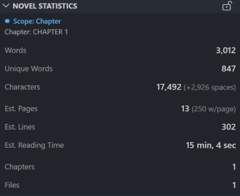

### Characters Panel

Lists all characters from the Canon Editor with their mention counts across the novel. Characters can be added manually via Canon Editor → New, or are populated automatically after DSM analysis. Sort alphabetically or by order of appearance — configurable in settings.

Expand any character to see a per-chapter breakdown with occurrence counts. Click an occurrence to jump to it in the manuscript.


### Character Hover

Hover over any character name in the editor to see that character's description and aliases as a tooltip — right where you're writing, without switching panels. Uses the same canon data as the Characters panel. Can be turned off via `draftScript.characterHover`.

### Manuscript Analytics

A dedicated sidebar panel that analyzes word and phrase frequency across the novel or the current document. Helps identify overused words and repeated phrasing. Click a phrase to jump to its next occurrence in the text.

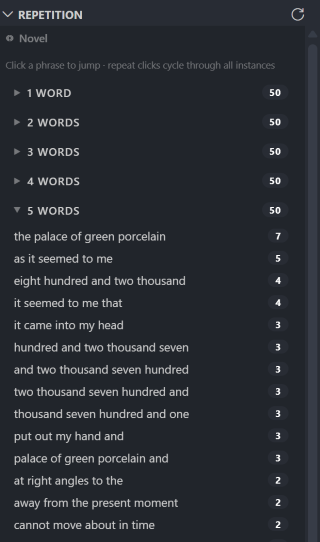 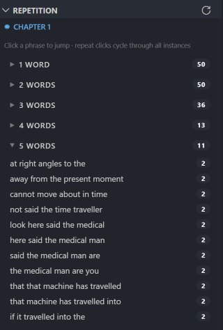

### Inline Comments / Annotations

Select any passage in a Markdown file, then right-click → *Add Comment to Selection* (or `Ctrl+Shift+P` → *Draft-Script: Add Comment*).

- Wraps the selection with an invisible HTML comment tag (`<!--link-N-->…<!--/link-N-->`).
- Appends the note to `notes.md` in your workspace root, with the passage excerpt and your comment.
- Annotated passages are highlighted in the editor with hover tooltips showing the note.

**Split-file novels:** When the novel folder contains more than one Markdown file (one file per chapter), the Chapter Focus mode toggle is hidden — it only applies to single-file novels.

### Disabling LLM Features

All LLM-powered functionality can be disabled with a single setting:

```json
"draftScript.enableLLM": false
```

When disabled, LLM-dependent panels (Dashboards, Manuscript Analytics) show a placeholder instead of their normal content, and all DSM commands disappear from menus and the Command Palette. Non-LLM features — the Navigator, Statistics, Characters, and Comments panels — are unaffected. Changes take effect immediately — no reload required.

To hide individual panels, use VS Code's built-in view visibility controls: right-click any panel header in the sidebar to show or hide sub-panels. VS Code persists this state automatically.

---

### DSM — Draft Script Monitor

Analyzes chapter text and extracts a structured **canon index** — characters, locations, objects, groups, thread lifecycle updates, timeline events, and continuity notes — using an LLM. You always review and approve before anything is written.

**Analyzing a chapter:**

1. Right-click a chapter heading in the Navigator → *DSM: Analyze Chapter*.
   Or select a passage in the editor → right-click → *DSM: Analyze Selected Text*.
2. A review tab opens showing all extracted entities grouped by category. Each row shows the name, confidence score, and role in the chapter.
3. Entities are pre-classified:
   - **new** — not yet in the canon
   - **uncertain** — possible match to an existing canon entry (name is similar but not identical)
   - **indexed** — already confirmed in the canon
4. Approve individual rows, or click **Approve All New** to approve everything in one step.
5. Click **Save** — approved entities are added to the canon and the indexes are rebuilt.

**Scan automatically:** Enable the *Scan automatically* toggle in the review toolbar to approve and save without manual confirmation. Set the minimum confidence threshold to control which entities qualify. Enable **Merge uncertain** (shown when *Scan automatically* is on) to also auto-confirm uncertain entities — rather than creating new canon entries, they are silently linked to their closest existing match and the analysis record is updated in place. Chapters with the orange ↻ icon in the Navigator are candidates for re-scanning.

**Rescan Changed Chapters:** Run `Ctrl+Shift+P` → *DSM: Rescan Changed Chapters* to batch-process all chapters whose text has changed since the last scan (orange ↻ icon). DSM re-analyzes each one automatically, applies auto-approval, and rebuilds all indexes in a single pass. No review panel opens; a progress notification shows which chapter is being processed. If a scan is already running, a warning is shown instead of starting a second one. Two settings control the batch behavior:

- **Rescan min certainty** (`draftScript.dsmRescanMinCertainty`, default 80) — minimum confidence % for auto-approving new entities.
- **Merge uncertain on rescan** (`draftScript.dsmRescanMergeUncertain`, default off) — when enabled, uncertain entities above the threshold are silently linked to their closest existing canon match instead of being left for manual review.

**Canon Editor:** The book icon in the Characters panel toolbar opens the Canon Editor — a full two-column editor for all canon categories (characters, locations, objects, groups) plus read-only **Threads**, **Timeline**, and **Continuity** tabs, and a **Signals** tab. From here you can edit names, aliases, and descriptions, merge duplicate entries, and delete entries. Merging rewrites all chapter analysis references automatically.

Each entity's editor pane shows an **Appearances** row listing every chapter where that entity was detected. Click any chapter number to jump directly to the passage where the entity was found — the editor scrolls to the exact quoted text reference in that chapter.

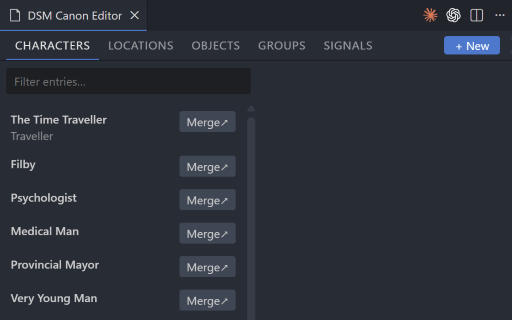

The **Threads** tab lists indexed threads across the novel with their type, lifecycle status, suggested status, review flags, and chapter links. The **Timeline** tab shows all timeline events grouped by chapter — clicking a chapter heading opens that file. The **Continuity** tab lists all continuity items with their type, status, and the chapters where they were mentioned. All three are read-only views rebuilt automatically whenever the canon or analysis files change.

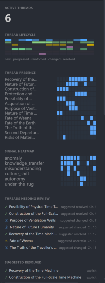 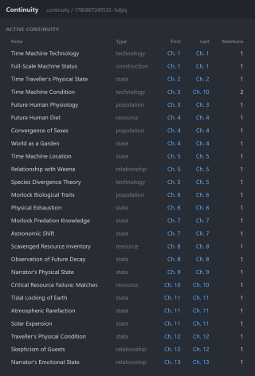

**DSM Signals:** Signals are lightweight semantic labels attached to timeline events, thread updates, and continuity notes during analysis. They track recurring narrative patterns across the novel — things like `knowledge_transfer`, `autonomy`, or `institution_seed`. Unlike entities, signals are not characters or places; they are thematic markers you define.

To use signals:

1. Open the Canon Editor → **Signals** tab.
2. Create signals with a stable ID (e.g. `knowledge_transfer`) and a one-sentence description of when it applies.
3. Drag rows to reorder. Click **Save** — signals are written to `canon/signals.json`.
4. Re-analyze chapters. The LLM will tag matching events, threads, and notes with your signal IDs. It can only assign IDs from your list — hallucinated IDs are filtered out before saving.
5. Use **Discover from analyses** to surface any signal IDs already present in existing analysis files but not yet defined (useful when resuming work or importing a project).

Signal definitions are stored in `.draft-script/canon/signals.json`. On the first scan, the file is created automatically with a set of built-in defaults if it does not exist. The signal index at `.draft-script/indexes/signals.json` maps each signal ID to every chapter/source where it was assigned.
Signals are optional. Most chapters will contain few or no signals.

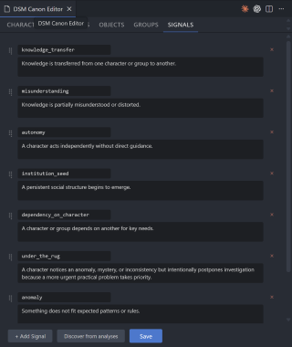

**DSM Time Index:** During analysis the LLM extracts temporal evidence from each chapter and generates probabilistic temporal metadata, not canonical chronology. The extracted data includes seasonal span (`startSeason` / `endSeason`), a `chapterAnchor` representing the dominant present-time story-world season after the chapter concludes, raw time references with optional role tags (`current`, `flashback`, `dream`, `history`, `projection`), and two distinct duration estimates — `sceneDuration` (actively dramatized scenes only) and `coveredTimeSpan` (total story-world time including montage and narrative summaries). This data is stored in `analysis/chapters/` and aggregated into `indexes/timeIndex.json`.

Three temporal concepts are kept separate: `startSeason`/`endSeason` describe what span the chapter covers; `chapterAnchor` answers "what is the dominant present-time story-world season after this chapter?" (ignoring flashbacks, dreams, projections, and historical narration); and `sceneDuration` vs `coveredTimeSpan` distinguish active drama from compressed time. A chapter with a one-day hunt followed by months of montage will have a small `sceneDuration` and a large `coveredTimeSpan`.

The Time Index is separate from Timeline Events. A timeline event is something that happens. A time reference is evidence of how much story-world time passes.

Use `"source": "timeIndex"` in dashboard widgets. The `currentSeasonValue` flat field resolves the best available season using fallback order (`chapterAnchor` → `endSeason` → `startSeason`). See `DASHBOARD.md` for the full field reference.


**Dashboards:** Dashboard profiles are JSON files stored in `.draft-script/dashboards/`. The sidebar is just the `sidebar.json` profile, and `Draft-Script: Open Dashboard` can open any profile in a WebviewPanel.

Profiles reference existing widget IDs:

```json
{
  "id": "threads",
  "title": "Threads",
  "layout": "vertical",
  "widgets": [
    "active_threads",
    "dormant_threads",
    "threads_review"
  ]
}
```

Multiple dashboard panels can be opened at the same time, including multiple instances of the same profile.

Available `source` values: `characters`, `locations`, `objects`, `groups`, `timeline`, `threads`, `continuity`, `signals`, `timeIndex`.

Available `view.type` values: `metric`, `list`, `warning-list`, `table`, `bar-list`, `timeline`.

**Field config**

Each entry in `view.fields` is either a plain string shorthand (`"name"`) or a full field descriptor object:

| Property | Type | Description |
|---|---|---|
| `key` | string | Field name from the index row |
| `label` | string | Column header label (table view); defaults to `key` |
| `format` | string | Template string — `{value}` is replaced with the field value (e.g. `"Ch. {value}"`) |
| `fallback` | string | Value shown when the field is null or empty |
| `align` | `left` \| `center` \| `right` | Text alignment in table columns |
| `maxLength` | number | Truncate text to this many characters |
| `className` | string | CSS class added to the cell (e.g. `"dim"`) |
| `hidden` | boolean | Exclude field from rendering while keeping it available for fallback/tooltip |

**Metric widgets**

`view.type: "metric"` shows a single aggregated number. Configure with `view.metric`:

```json
"view": {
  "type": "metric",
  "metric": { "type": "count", "label": "total" }
}
```

`metric.type` values: `count`, `sum`, `avg`, `max`, `min`. `label` is optional — shown below the number.

**Bar-list widgets**

Use `primaryField` and `valueField` to explicitly name which fields to use:

```json
"view": {
  "type": "bar-list",
  "primaryField": "name",
  "valueField": "appearanceCount"
}
```

**Layout**

Dashboard profiles currently support `"layout": "vertical"`. The architecture is prepared for future layouts such as `grid`, `columns`, and `tabs`.

**Advanced filters**

Filter values support comparison operators as objects alongside plain equality:

```json
"filter": {
  "status": "open",
  "appearanceCount": { "gte": 3 },
  "type": { "in": ["promise", "conflict"] }
}
```

Supported operators: `eq`, `ne`, `lt`, `lte`, `gt`, `gte`, `in`, `notIn`, `includes`, `includesAny`, `includesAll`.

Special filters: `lastSeenBeforeChapters: N` (not seen in last N chapters from the current end), `firstSeenAfterChapter: N` (introduced after chapter N).

Dashboard profile files are created on first dashboard use and stored in `.draft-script/dashboards/`:

| File | Purpose |
|---|---|
| `sidebar.json` | Sidebar dashboard profile |
| `threads.json` | Thread lifecycle dashboard |
| `timeline.json` | Timeline dashboard |
| `characters.json` | Character dashboard |
| `continuity.json` | Continuity dashboard |

Edit any profile to add, remove, or reorder widget IDs. Use `Draft-Script: Reload Dashboards` after editing.

 

**Dashboard presets**

The `examples/dashboards/` folder contains ready-to-use profile examples. Copy any profile JSON into `.draft-script/dashboards/`, then run `Draft-Script: Reload Dashboards`.

| Preset | Focus |
|---|---|
| `mystery.json` | Open threads, mysteries, risks, timeline, continuity gaps |
| `fantasy-worldbuilding.json` | Locations, factions, objects, lore continuity |
| `character-drama.json` | Character arcs, appearances, promises/conflicts, dropped characters |
| `chronicle.json` | Full timeline, character arcs, long-running threads, continuity |

**Regenerate Indexes:** `Ctrl+Shift+P` → *DSM: Regenerate Indexes* rebuilds all index files from the existing analysis files without running the LLM again. Useful when updating to a new version or after manually editing analysis files. Offers two options:

- **Rebuild indexes only** — rebuilds all indexes, keeps all canon entries intact.
- **Rebuild indexes + clear canon entries** — also wipes `canon/characters.json`, `canon/locations.json`, `canon/objects.json`, and `canon/groups.json` for a clean slate. Signal definitions in `canon/signals.json` are never touched.

**Prompt Runner:** Define custom prompts — developmental edit, beta reader, continuity check, pacing, next-chapter drafts — and run them on any chapter from the Navigator or Command Palette. Each prompt is a `.md` file with a YAML header in `.draft-script/prompts/`. Three commands share the same prompt picker and context assembly:

- **Preview Prompt** — builds the prompt and opens a read-only document showing every context block with character/token counts, then the full rendered prompt. Use this to tune prompts and inspect token usage before sending anything to an LLM.
- **Copy Prompt to Clipboard** — builds the prompt and copies it directly to the clipboard. Useful for pasting into ChatGPT, Claude.ai, Gemini, or any other web interface.
- **Run Prompt** — builds the prompt, calls the configured LLM, and opens the result in a tab beside the chapter. If the estimated token count exceeds `draftScript.promptWarningTokens` (default 10,000), a confirmation dialog is shown first.
- **Run And Save Output** — same as *Run Prompt* but writes the result to a file defined in the prompt's `output:` config instead of opening a tab. Useful for writer prompts that generate new chapter files.

The `visibility` field in the prompt header controls which indexed data the context builder exposes — `all` (default), `upToChapter` (entities introduced up to and including the current chapter), `previousChapters` (prior canon only, ideal for contradiction checking), or `currentChapterOnly` (new introductions in this chapter). Signals, chapter text, and project instructions are always unfiltered.

Prompts are hot-reloaded — saving any file in `.draft-script/prompts/` updates the list immediately.

**Writer prompts:** Add `writer: true` to a prompt's YAML header to mark it as a chapter-writing prompt. When you run a writer prompt, a brief input box appears first — type what should happen in the next chapter, or leave it blank to let the prompt decide. The brief is available as `{{userBrief}}` anywhere in the prompt body (resolves to an empty string if skipped). Use `{{nextChapterNumber}}` in the prompt body or in the `output.path` field to insert the next chapter's number automatically.

Example writer prompt header:

```yaml
---
title: Write Next Chapter
writer: true
context:
  - activeThreads
  - dormantThreads
  - timeline
output:
  path: "{{nextChapterNumber}} - Draft.md"
  format: markdown
---
```

See [PROMPTS.md](PROMPTS.md) for the full reference.

**Story Navigator:** `Ctrl+Shift+P` → *DSM: Story Navigator* opens a popup panel with two modes:

- **Search** — type any term to search across all indexes at once: threads, continuity, characters, locations, objects, groups, and timeline. Results show entity type and status badges and chapter appearance chips. Click any chip to jump to that chapter — the editor scrolls to and selects the exact reference passage where the entity was mentioned.
- **Browse** — explore a single index type at a time using the tab bar at the top (Threads, Continuity, Characters, Locations, Objects, Groups, Timeline, Signals). A text filter input below the tab bar narrows results as you type. Threads and Continuity tabs additionally support type and status pill filters that combine with the text filter. The Signals tab lists all signal IDs sorted by frequency; click any signal to expand its list of linked threads, continuity notes, and timeline events, each with chapter chips.

Chips show up to 20 entries at a time — click *+N more* to reveal the next 20.

**Custom prompt:** On the first DSM scan, `.draft-script/prompts/dsm-analysis.md` is created automatically with the full built-in prompt. Edit this file directly to customize how the LLM extracts entities — no settings needed. The file uses placeholders that are substituted at scan time:

| Placeholder | Replaced with |
|---|---|
| `{{text}}` | The chapter text being analyzed |
| `{{candidates}}` | Pre-extracted name hints from the text |
| `{{context}}` | Known active/open threads and timeline events from previous chapters |
| `{{signals}}` | The current signal definitions from `signals.json` |
| `{{schema}}` | The required JSON output format (always appended if missing) |

**Data is stored in `.draft-script/` in your workspace root:**

```
.draft-script/
  prompts/
    dsm-analysis.md        ← editable extraction prompt (created on first scan)
  canon/
    characters.json        ← approved canon entries
    locations.json
    objects.json
    groups.json
    signals.json           ← signal definitions (created on first scan)
  analysis/
    chapters/              ← per-chapter LLM output + content hash
  indexes/
    characters.json        ← aggregated appearances, descriptions, roles
    locations.json
    objects.json
    groups.json
    timeline.json
    threads.json
    continuity.json
    reference.json         ← flat index of all quoted/paraphrased text references
    chapters.json          ← chapter ID → file path (used for navigation)
    signals.json           ← signal ID → list of chapters/sources
    timeIndex.json         ← per-chapter temporal evidence and season/duration estimates
  .draft-script/
    dashboards/
      sidebar.json         ← sidebar dashboard profile
      threads.json         ← thread dashboard profile
      timeline.json        ← timeline dashboard profile
      characters.json      ← character dashboard profile
      continuity.json      ← continuity dashboard profile
```

**LLM provider** is configurable — Copilot (default), OpenAI, Ollama, or Mock (for offline testing without any API call).

**DSM: Open Index Explorer:** A raw data browser for all DSM indexes. Opens a two-panel view — pick an index category on the left (Characters, Locations, Objects, Groups, Threads) and browse the full index entries on the right. Useful for inspecting what DSM has indexed before editing the canon, or for debugging analysis output.

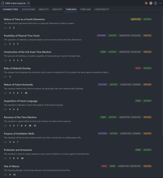 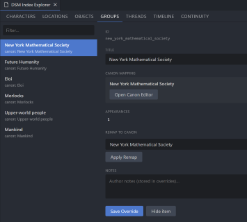

---

### Time Inspector

Three no-LLM commands that read the existing `timeIndex.json` and report temporal structure to an Output Channel panel — no LLM call required.

- **Inspect Chapter Time** — pick any analyzed chapter from a QuickPick list. Reports the chapter's season span, anchor season, scene duration, covered story time, gap from the previous chapter, and the approximate story-day position since chapter one.
- **Inspect Time Range** — pick a start and end chapter. Reports aggregated duration, total covered story time, and the dominant season across the range.
- **Inspect Current Chapter Time** — same as *Inspect Chapter Time* but uses whichever chapter the cursor is currently in, with no picker.

All three write their output to the *Draft-Script Time Inspector* Output Channel (`View → Output → Draft-Script Time Inspector`).

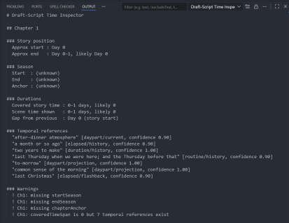 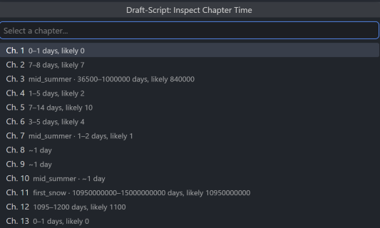

---

### Smart Dashes

Typing `--` automatically converts to an em-dash (`—`). Skips code spans. Can be disabled in settings.

### Typewriter Mode

Keeps the cursor vertically centered as you type, so the text scrolls upward like paper through a typewriter. Disabled by default. Toggle via settings.

### Auto-Refresh

The Navigator, Statistics, Characters, Analytics, and Dashboard panels refresh automatically when any Markdown file in the workspace changes, is created, or deleted.

---

## Setup

1. Open your novel folder as a VS Code workspace.
2. If your Markdown files live in a subfolder, point the extension to it:
   - `Ctrl+Shift+P` → *Draft-Script: Select Novel Root Folder*
   - Or set `draftScript.novelFolder` in your workspace settings.
3. Characters are populated automatically after DSM analysis. To add characters before running analysis, open the Canon Editor and use the *New* button.

---

## Novel Structure

Draft-Script supports two layouts. Both work with the same features — choose whichever fits your workflow.

### Single-file novel

All chapters live in one `.md` file. Each chapter starts with an h1 heading that includes the chapter number (required for DSM). Sub-headings (h2 and deeper) are supported and appear indented in the Navigator.

```markdown
# Chapter 1: The Beginning

Prose content...

## The Arrival

Scene prose...

## Nightfall

Scene prose...

# Chapter 2: The Middle

Prose content...
```

The heading format is controlled by `draftScript.chapterFormat` (default `Chapter {num}:`). The number placeholder `{num}` is required — DSM uses the chapter number to identify and cross-reference chapters across analyses.

A single-file novel can coexist with other `.md` files in the same workspace root (e.g. `notes.md`). Those files are ignored by the Navigator and DSM as long as `draftScript.novelFolder` points to the workspace root and the files use different names.

### Multi-file novel

Each chapter lives in its own `.md` file, all in a **dedicated subfolder**. This is important: if the novel folder is the workspace root, every `.md` file in the workspace gets parsed — including character sheets, notes, and outlines. A subfolder keeps the Navigator and DSM focused on chapter files only.

```
my-novel/                   ← workspace root
  novel/                    ← set draftScript.novelFolder to this
    chapter-01.md
    chapter-02.md
    chapter-03.md
  notes.md                  ← outside novel folder, not parsed
  notes.md
  .vscode/
    settings.json
```

Each chapter file starts with the same h1 format as the single-file case:

```markdown
# Chapter 1: The Beginning

Prose content...

## The Arrival

Scene prose...
```

Point the extension to the subfolder:

- `Ctrl+Shift+P` → *Draft-Script: Select Novel Root Folder* and pick `novel/`
- Or add to `.vscode/settings.json`:

```json
{
  "draftScript.novelFolder": "novel"
}
```

Files are sorted alphanumerically, so a numeric prefix (`chapter-01`, `chapter-02` …) keeps them in order. Chapter Focus mode is automatically hidden for multi-file novels — clicking a Navigator heading opens the file directly instead.

---

## Commands

| Command | Description |
|---|---|
| `Ctrl+Enter` | Add a new chapter |
| *Draft-Script: Add Chapter* | Add a new chapter (Command Palette) |
| *Draft-Script: Toggle Chapter Focus* | Switch between continuous and focus navigation |
| *Draft-Script: Merge All Chapters* | Concatenate all chapter files into a single document |
| *Draft-Script: Split Document by Headings* | Split a single document into individual chapter files |
| *Draft-Script: Select Novel Root Folder* | Point the extension to your novel folder |
| *Draft-Script: Add Comment to Selection* | Annotate selected text (also in right-click menu) |
| *DSM: Analyze Selected Text* | Extract entities from selected text using an LLM (also in right-click menu) |
| *DSM: Analyze Chapter* | Analyze a chapter heading from the Navigator right-click menu |
| *DSM: Rescan Changed Chapters* | Batch re-analyze all chapters with changes since the last scan |
| *DSM: Open Canon Editor* | Open the Canon Editor panel |
| *Draft-Script: Open Dashboard* | Pick and open any dashboard profile |
| *Draft-Script: Reload Dashboards* | Reload dashboard profiles and refresh open dashboard panels |
| *Draft-Script: Open Dashboard Folder* | Open `.draft-script/dashboards/` |
| *DSM: Regenerate Indexes* | Rebuild all indexes from existing analysis files |
| *DSM: Preview Prompt* | Build a prompt and open a read-only preview showing context blocks, token estimates, and the full rendered prompt |
| *DSM: Copy Prompt to Clipboard* | Build a prompt and copy it to the clipboard — for use with external tools like ChatGPT, Claude, or Gemini |
| *DSM: Run Prompt* | Build and send a prompt to the configured LLM; result opens in a tab beside the chapter |
| *DSM: Run And Save Output* | Build and send a prompt; result is saved to a file defined in the prompt's `output:` config |
| *DSM: Mark as Scanned* | Reset the orange sync indicator on a chapter heading without re-running analysis (right-click menu) |
| *DSM: Story Navigator* | Open a popup panel to search or browse all DSM indexes |
| *DSM: Open Index Explorer* | Browse raw DSM index data by category |
| *Draft-Script: Inspect Chapter Time* | Report temporal data for a selected chapter to the Output Channel |
| *Draft-Script: Inspect Time Range* | Report aggregated temporal data for a chapter range to the Output Channel |
| *Draft-Script: Inspect Current Chapter Time* | Report temporal data for the chapter the cursor is in |
| *DSM: Select VS Code LM Model* | Pick the Copilot language model used for analysis |
| *DSM: Select Ollama Model* | Query the running Ollama instance and pick a model from the list |

---

## Settings

| Setting | Default | Description |
|---|---|---|
| `draftScript.enableLLM` | `true` | Master switch for all LLM-powered features (indexes, analytics, beta reader, etc.). When disabled, LLM panels show a placeholder and all related commands are hidden. |
| `draftScript.novelFolder` | *(workspace root)* | Path to the folder containing your novel files. |
| `draftScript.chapterFormat` | `Chapter {num}:` | Heading format for new chapters. Use `{num}` as the number placeholder. |
| `draftScript.viewMode` | `continuous` | `continuous` or `focus` — controls Navigator click behavior. |
| `draftScript.showTreeWordCount` | `true` | Show word count badges in the Navigator tree. |
| `draftScript.characterHover` | `true` | Show character details on hover in the editor. |
| `draftScript.enableSmartDashes` | `true` | Convert `--` to `—` while typing. |
| `draftScript.typewriterMode` | `false` | Keep cursor vertically centered while typing. |
| `draftScript.characterSorting` | `appearance` | Sort characters by `appearance` or `alphabetical`. |
| `draftScript.showCharacterCount` | `true` | Show mention counts in the Characters panel. |
| `draftScript.characterInflections` | `false` | Count inflected name forms as mentions. |
| `draftScript.inflectionFeminineIn` | `false` | Also count the `-in` possessive paradigm for feminine names ending in `-a`. |
| `draftScript.inflectionSuffixes` | *(Slavic suffix list)* | Custom suffix list used when inflection counting is enabled. |
| `draftScript.dsmProvider` | `vscode-lm` | LLM provider for DSM: `vscode-lm` (Copilot), `openai`, `ollama`, or `mock`. |
| `draftScript.dsmReviewFontSize` | `13` | Base font size (px) for the DSM Review and Canon Editor panels. |
| `draftScript.dsmTimeoutSeconds` | `180` | Timeout in seconds for LLM requests. Increase for long chapters. |
| `draftScript.dsmAutoScanMinCertainty` | `80` | Minimum confidence % required for auto-approval when *Scan automatically* is enabled. |
| `draftScript.dsmRescanMinCertainty` | `80` | Minimum confidence % for auto-approval when running *Rescan Changed Chapters*. |
| `draftScript.dsmRescanMergeUncertain` | `false` | Auto-link uncertain entities to their closest canon match during rescan. |
| `draftScript.promptWarningTokens` | `10000` | Show a confirmation dialog before running a prompt when the estimated token count exceeds this threshold. Set to a very high number to disable. |
| `draftScript.dsmOpenAiApiKey` | *(empty)* | OpenAI API key. Required when `dsmProvider` is `openai`. |
| `draftScript.dsmOpenAiModel` | `gpt-4.1-mini` | OpenAI model used for DSM analysis. |
| `draftScript.dsmOllamaUrl` | `http://localhost:11434` | Ollama base URL. Required when `dsmProvider` is `ollama`. |
| `draftScript.dsmOllamaModel` | `llama3` | Ollama model used for DSM analysis. |

---

## Tips

**Clean up the sidebar for writing**

VS Code's Activity Bar shows buttons for Git, Extensions, Debug, and Search that aren't useful while writing. All features remain available via keyboard shortcuts regardless of whether their icons are visible.

**Option 1 — Hide the entire Activity Bar** (workspace setting)

Add this to your `.vscode/settings.json`:

```json
{
  "workbench.activityBar.visible": false
}
```

Draft-Script panels are still reachable via `Ctrl+Shift+P`. Git (`Ctrl+Shift+G`), Search (`Ctrl+Shift+F`), and Debug (`F5`) all continue to work normally.

**Option 2 — Hide individual icons**

Right-click any Activity Bar icon and uncheck the items you don't need. Note: this is a per-user preference and applies across all workspaces, not just this one.

**Option 3 — VS Code Profile**

Create a dedicated *Writing* profile (`File → Preferences → Profiles → Create Profile`) with only the panels you need visible. Profiles are the closest VS Code offers to a per-workspace Activity Bar layout.

**Recommended setup:**

1. Start from your existing profile where GitHub Copilot already works.
2. Select **Create Profile**.
3. Choose **Copy from Current Profile** (or **Default Profile**).
4. Keep all profile components selected (Settings, Extensions, UI State, Keybindings, Snippets, Tasks, etc.).
5. Name the profile (for example: *Writing* or *Draft-Script*).

This ensures Copilot, language model access, authentication state, and extension configuration are carried over correctly.

Creating an empty profile may require re-authentication and can prevent VS Code Language Models from being available to extensions until the profile is configured manually.

### Ollama Model Recommendations

To pick a model without editing settings manually, run **DSM: Select Ollama Model** from the Command Palette. It queries the running Ollama instance and shows the available models in a list.

DSM primarily performs structured extraction and JSON generation rather than creative writing. Model reliability and JSON consistency are usually more important than prose quality.

**For English-only projects:** most modern 8B–14B instruction-tuned models should work well.

**For multilingual projects:** larger models generally produce more reliable extraction results, especially when working with less common languages.

In testing, **Gemma 3/4 31B** produced significantly more stable JSON output for Serbian-language novels than smaller Gemma variants.

If DSM frequently produces malformed JSON, missing entities, or inconsistent classifications, try a larger model before modifying prompts.

Recommended starting points:

* Gemma 27B / 32B+
* Qwen 30B+
* Other instruction-tuned models with strong multilingual support

### Cost Considerations

DSM may generate a significant number of LLM requests when analyzing chapters, rebuilding indexes, or re-scanning large projects.

**Local models (Ollama)** run entirely on your machine and do not consume API credits, tokens, or premium requests.

**Cloud providers** such as OpenAI and some VS Code Language Models may consume paid usage, premium requests, or token quotas depending on your subscription plan and model selection.

Before analyzing large novels, verify the limits and pricing associated with your chosen provider.

For frequent DSM use, a local Ollama model is often the most cost-effective option.


## Troubleshooting

### DSM reports "No VS Code language model available"

1. Verify that GitHub Copilot Chat works in the **same VS Code profile**.
2. Open the Copilot Chat panel and send a test message.
3. Reload VS Code after authentication.
4. If you are using a custom profile, recreate it using **Copy from Current Profile** (or **Default Profile**) and copy all profile components.
5. Try switching back to the Default profile to confirm the issue is profile-related.

**Note:** It is possible for Copilot Chat to appear installed and functional while the VS Code Language Model API returns no available models for third-party extensions. This is most commonly caused by profile configuration issues.
